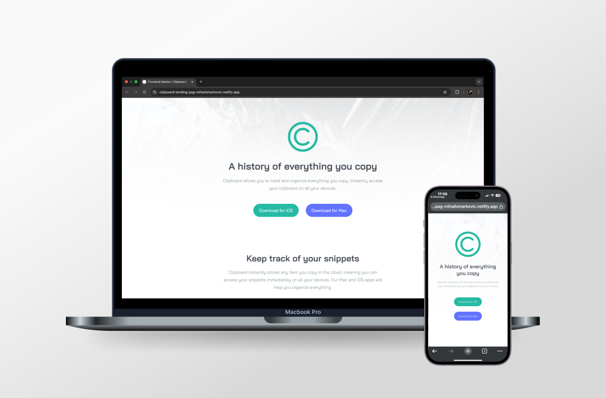

# [Clipboard Landing Page](https://clipboard-landing-pag-mihailomarkovic.netlify.app/)

## Introduction

This repository contains my solution to the Clipboard Landing Page challenge from [Frontend Mentor](https://www.frontendmentor.io). The challenge was to create a modern and responsive landing page that effectively presents Clipboard's features and functionality.

## Overview

The goal of this project was to enhance my **HTML**, **CSS**, and **SASS** skills by building a structured and visually appealing landing page. The design emphasizes clarity, simplicity, and responsiveness while maintaining accessibility best practices.

## Features

- Fully responsive layout for different screen sizes.
- Structured with **CSS Grid** and **Flexbox** for better alignment.
- Styled using **SASS** for modular and maintainable CSS.
- Smooth hover effects for interactive elements.

## What I Learned

This project helped me improve my ability to:

1. Implement a **desktop-first** approach for better responsiveness.
2. Utilize **CSS Grid** and **Flexbox** effectively for layout structuring.
3. Organize and optimize styles using **SASS**.

## Continued Development

In future projects, I aim to:

- Experiment with **CSS animations** to create more engaging interactions.
- Improve **accessibility** by ensuring proper semantic markup.
- Optimize **performance** to enhance loading speed and efficiency.
